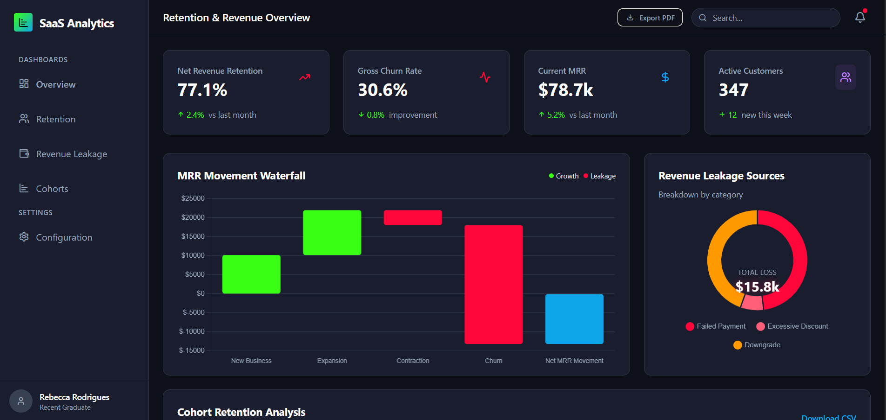

# SaaS-Retention---Revenue-Leakage-Tracker
This SaaS Analytics Dashboard is a comprehensive data visualization tool designed for subscription-based businesses to monitor financial health and customer retention. It transforms complex billing data into actionable insights, allowing Stakeholders and Customer Success teams to identify "leaky buckets" in their revenue stream.
# SaaS Analytics Dashboard 🚀

A comprehensive, data-driven dashboard designed for SaaS companies to monitor **Revenue Retention**, **Churn Analysis**, and **MRR Movements**. This project provides actionable insights into customer lifecycles and revenue leakage.



## 📊 Key Features

### 1. Revenue & Retention KPIs
High-level summary of the most critical SaaS health metrics:
* **Net Revenue Retention (NRR):** Tracking growth within existing customers.
* **Gross Churn Rate:** Monitoring lost revenue with month-over-month comparisons.
* **Current MRR:** Real-time tracking of Monthly Recurring Revenue.
* **Active Customers:** Live count of current subscriber base.

### 2. MRR Movement Waterfall
A visual breakdown of how revenue flows in and out of the business, categorized by:
* **New Business:** Revenue from new sign-ups.
* **Expansion:** Upsells and cross-sells to existing users.
* **Contraction:** Downgrades or reduced usage.
* **Churn:** Complete loss of accounts.

### 3. Cohort Retention Analysis
A heat-map style grid (M+0 to M+5) that tracks user retention behavior based on their sign-up month. This helps identify which cohorts are sticking around and where the "drop-off" points are.

### 4. Revenue Leakage Identification
A specialized donut chart and alert system to identify why money is being lost:
* **Failed Payments:** Involuntary churn due to billing issues.
* **Excessive Discounts:** Margin erosion from heavy couponing.
* **Downgrades:** Movement to lower-tier plans.

### 5. Risk Alerts & Churn Reasons
A real-time feed of specific customers at risk or recently lost, including reasons like "Price too high" or "Budget cuts," allowing for immediate customer success intervention.

---

## 🛠️ Tech Stack

* **Frontend:** React / Next.js (Tailwind CSS for styling)
* **Charts:** Recharts / Chart.js / D3.js
* **Icons:** Lucide React
* **State Management:** TanStack Query (React Query) / Context API

---

## 🚀 Getting Started

### Prerequisites
* Node.js (v18 or higher)
* npm or yarn

### Installation
1. **Clone the repo:**
   ```bash
   git clone [https://github.com/yourusername/saas-analytics-dashboard.git](https://github.com/yourusername/saas-analytics-dashboard.git)
